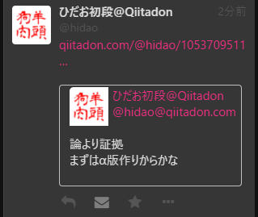

# Qiitadon用 引用Toot Chrome機能拡張

## インストール

1. ソースをzipでダウンロードする
1. ダウンロードしたzipファイルを任意の場所へ展開する
1. Chromeの　設定＞機能拡張＞デベロッパーモード　をオンにする
1. Chromeの　設定＞機能拡張＞パッケージ化されていない機能拡張を読み込む　をクリック
1. zipファイルを展開したフォルダを選択する
1. Qiitadonをリロードする

※画面は開発中のものです

## ToDo

- [x] 新着のtootに適用されない
- [x] ligth テーマでスタイルが崩れる
- [ ] ligth テーマ変更直後でスタイルが崩れる（Qiitadon をリロードすれば直る）
- [ ] 複数の引用がある場合、最後のリンクのみが有効になる
- [x] CWに対応